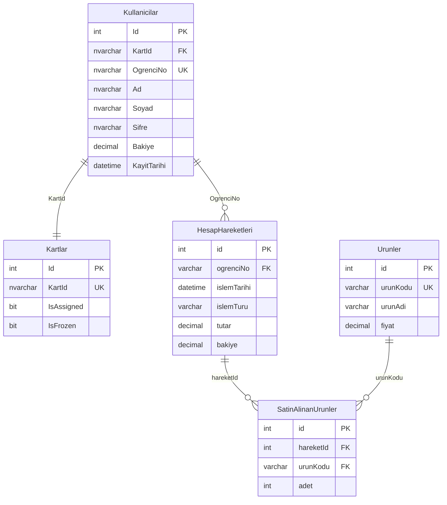

# 🗄️ KampusKantin Veritabanı

Bu klasör KampusKantin projesinin veritabanı yapılandırması ve scriptlerini içerir.

## 📁 Dosya Yapısı

```
database/
├── schema.sql           # Veritabanı yapısı (tablolar, indexler, constraints)
├── sample-data.sql      # Örnek test verileri
├── config-template.js   # Veritabanı bağlantı ayarları şablonu
└── README.md           # Bu dosya
```

## 🚀 Hızlı Kurulum

### 1. SQL Server Kurulumu

#### Windows için:
```bash
# SQL Server Express indirin ve kurun
# https://www.microsoft.com/en-us/sql-server/sql-server-downloads

# SQL Server Management Studio (SSMS) indirin
# https://docs.microsoft.com/en-us/sql/ssms/download-sql-server-management-studio-ssms
```

#### Linux/macOS için:
```bash
# Docker ile SQL Server
docker run -e "ACCEPT_EULA=Y" -e "SA_PASSWORD=YourPassword123!" \
   -p 1433:1433 --name sqlserver \
   -d mcr.microsoft.com/mssql/server:2019-latest
```

### 2. Veritabanı Oluşturma

#### SSMS ile:
1. SQL Server Management Studio'yu açın
2. Lokal sunucuya bağlanın (`localhost\SQLEXPRESS`)
3. `schema.sql` dosyasını açın ve çalıştırın
4. `sample-data.sql` dosyasını açın ve çalıştırın

#### Komut satırı ile:
```bash
# sqlcmd ile bağlan
sqlcmd -S localhost\SQLEXPRESS -E

# Schema'yı çalıştır
sqlcmd -S localhost\SQLEXPRESS -E -i schema.sql

# Örnek verileri yükle
sqlcmd -S localhost\SQLEXPRESS -E -i sample-data.sql
```

### 3. Node.js Bağımlılıklarını Kur

Her backend projesi için:
```bash
# mssql paketini kur
npm install mssql

# Windows Authentication için (isteğe bağlı)
npm install msnodesqlv8
```

### 4. Bağlantı Ayarlarını Yapılandır

```bash
# config-template.js dosyasını kopyala
cp database/config-template.js database/config.js

# config.js dosyasını kendi ayarlarınla düzenle
```

## ⚙️ Yapılandırma

### Bağlantı Türleri

#### Windows Authentication (Önerilen):
```javascript
const config = {
  server: 'localhost\\SQLEXPRESS',
  database: 'KantinDB',
  options: {
    encrypt: false,
    trustServerCertificate: true
  },
  connectionString: "Driver={ODBC Driver 17 for SQL Server};Server=localhost\\SQLEXPRESS;Database=KantinDB;Trusted_Connection=Yes;",
  driver: "msnodesqlv8"
};
```

#### SQL Server Authentication:
```javascript
const config = {
  server: 'localhost\\SQLEXPRESS',
  database: 'KantinDB',
  user: 'your_username',
  password: 'your_password',
  options: {
    encrypt: false,
    trustServerCertificate: true
  }
};
```

#### Docker SQL Server:
```javascript
const config = {
  server: 'localhost',
  port: 1433,
  database: 'KantinDB',
  user: 'sa',
  password: 'YourPassword123!',
  options: {
    encrypt: false,
    trustServerCertificate: true
  }
};
```

## 📊 Veritabanı Şeması

### Tablolar ve İlişkiler



### Tablo Açıklamaları

#### **Kullanicilar**
- Öğrenci bilgilerini tutar
- Her öğrenci bir NFC karta sahip
- Bakiye bilgisi burada saklanır

#### **Kartlar**
- NFC kartlarının durumunu yönetir
- `IsAssigned`: Kart bir öğrenciye atanmış mı?
- `IsFrozen`: Kart dondurulmuş mu?

#### **HesapHareketleri**
- Tüm finansal işlemleri kayıt altına alır
- İşlem türleri: "Bakiye Yükleme", "Satın Alma"
- Her işlem sonrası güncel bakiye saklanır

#### **Urunler**
- Kantin ürünleri ve fiyatları
- Benzersiz ürün kodları

#### **SatinAlinanUrunler**
- Her satın alma işleminin detayları
- Hangi üründen kaç adet alındığı

## 🔧 Bakım ve İşlemler

### Veri Yedekleme
```sql
-- Veritabanını yedekle
BACKUP DATABASE [KantinDB] 
TO DISK = 'C:\Backup\KantinDB.bak'
WITH FORMAT, INIT;
```

### İndex Optimizasyonu
```sql
-- İndex durumunu kontrol et
SELECT 
    OBJECT_NAME(OBJECT_ID) AS TableName,
    name AS IndexName,
    avg_fragmentation_in_percent
FROM sys.dm_db_index_physical_stats(DB_ID(), NULL, NULL, NULL, NULL) AS ips
INNER JOIN sys.indexes AS i ON (ips.object_id = i.object_id) AND (ips.index_id = i.index_id)
WHERE avg_fragmentation_in_percent > 10;

-- İndexleri yeniden düzenle
ALTER INDEX ALL ON Kullanicilar REORGANIZE;
```

### Veri Temizleme
```sql
-- 6 ay önceki işlem kayıtlarını temizle
DELETE FROM HesapHareketleri 
WHERE islemTarihi < DATEADD(MONTH, -6, GETDATE());

-- Kullanılmayan kartları temizle
DELETE FROM Kartlar 
WHERE IsAssigned = 0 AND Id NOT IN (
    SELECT TOP 10 Id FROM Kartlar WHERE IsAssigned = 0
);
```

## 🐛 Sorun Giderme

### Yaygın Hatalar

#### "Login failed for user"
```bash
# Windows Authentication'ı kontrol edin
# SQL Server Configuration Manager'da TCP/IP aktif mi?
# Windows kullanıcısının SQL Server'a erişim yetkisi var mı?
```

#### "Cannot open database"
```bash
# Veritabanı var mı kontrol edin
# Bağlantı stringindeki database adını kontrol edin
```

#### "Driver not found"
```bash
# ODBC Driver 17 for SQL Server kurulu mu?
# Download: https://www.microsoft.com/en-us/download/details.aspx?id=56567
```

### Bağlantı Testi
```javascript
const sql = require('mssql');
const config = require('./config');

async function testConnection() {
  try {
    await sql.connect(config);
    console.log('✅ Veritabanı bağlantısı başarılı!');
    
    const result = await sql.query('SELECT COUNT(*) as count FROM Kullanicilar');
    console.log(`📊 Toplam kullanıcı sayısı: ${result.recordset[0].count}`);
    
  } catch (err) {
    console.error('❌ Bağlantı hatası:', err.message);
  } finally {
    await sql.close();
  }
}

testConnection();
```

## 📈 Performans İpuçları

1. **Indexleme**: Sık kullanılan kolonlar için index oluşturun
2. **Query Optimization**: WHERE clause'larda uygun indexleri kullanın
3. **Connection Pooling**: Bağlantı havuzu kullanın
4. **Parameterized Queries**: SQL injection'dan korunun

## 🔐 Güvenlik

1. **Şifre Hash'leme**: Kullanıcı şifrelerini hash'leyerek saklayın
2. **SQL Injection**: Parameterized query kullanın
3. **Least Privilege**: Minimum gerekli yetkileri verin
4. **Regular Backups**: Düzenli yedek alın

## 📞 Destek

Veritabanı ile ilgili sorunlarınız için:
- GitHub Issues açın
- SQL Server loglarını kontrol edin
- Connection string'i doğrulayın

---

*Bu dosya veritabanı yapısı değiştikçe güncellenecektir.*
